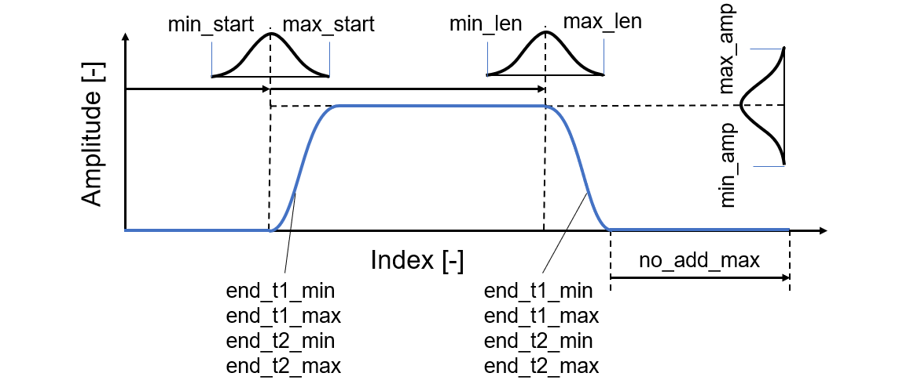

# ts_vae

* Functionality 1: Generation of a time series dataset with variable lengths and amplitudes
* 

## 📂 ts_dataset

* **visualize.ipynb** Documentation + vizualisation
* **create.py** Creates a time series dataset
* **create_opts.py** Options for dataset creation

Generierung der einzelnen Zeitreihen:

## 📂 ...

...